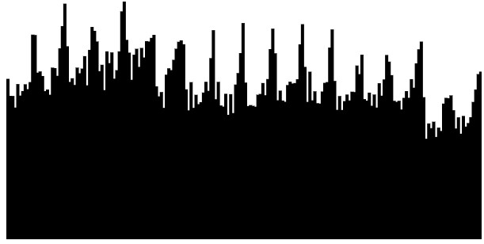
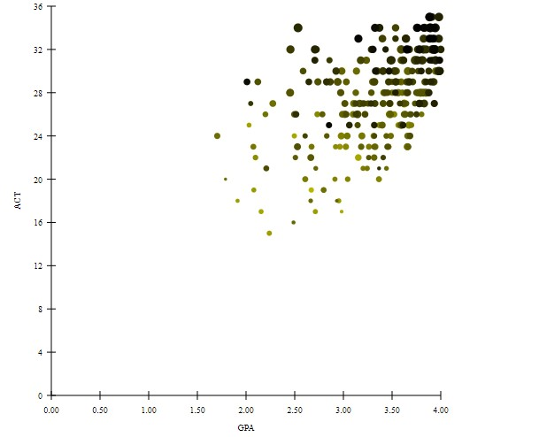

Author: Yahya Al Malallah [yahyaalmalallah@arizona.edu](mailto:EMAIL)  
Date: 2/14/2024

# D3 charts

## Overview
This project aims to visualize data related to ukDriverFatalities dataset, in addition to a scatterplot using SAT, ACT, and GPA scores.

## File Structure
- `index.html`: HTML file that contains the structure for displaying the charts(chart_1, chart_2, chart_3, scatterplot_2).
- `a03.js`: JavaScript file that contains the code for generating the charts and the scatterplot using data-driven documents(D3).
- `d3.js`: Holds the d3 library functionalities.
- `calvinScores.js`: JavaScript file that contains the data used to generate the scatterplot_2 visual.
- `ukDriverFatalities.js`: JavaScript file that contains the data used to generate the charts (chart_1, chart_2, and chart_3).

## Visuals

### Chart_1:

### Chart_2:

### Chart_3:

### Scatterplot 2:

**GPA vs. ACT**: 
- This scatterplot shows the relationship between GPA and ACT scores. 
- Circle size represents SATV scores (bigger circle = higher score).
- circle color represents SATM scores (darker circle = higher score).

## How to Use
1. Clone the repository to your local machine.
2. Open the `index.html` file in a web browser.
3. The scatterplots will be displayed based on the provided dataset.

NOTE: I used chrome as my browser (you can drag and drop the file)

If using VSCode:

You can open the program with "Open with live server".

